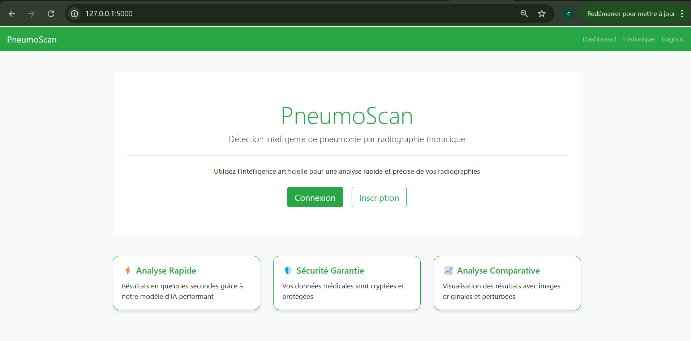
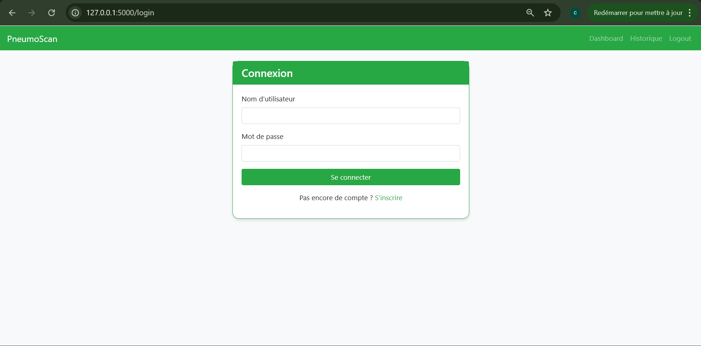
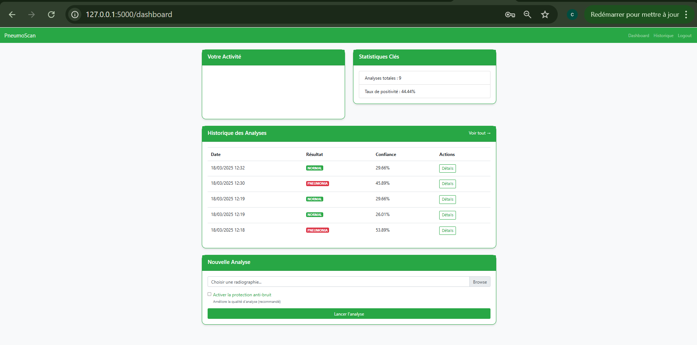
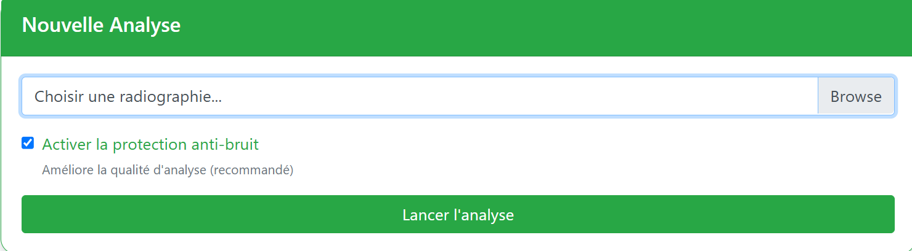
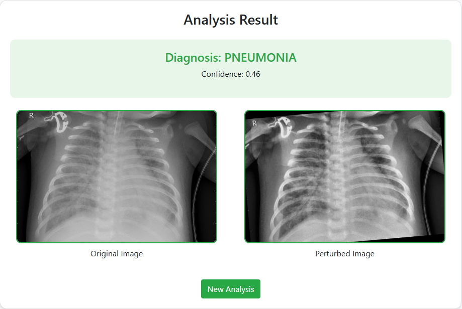
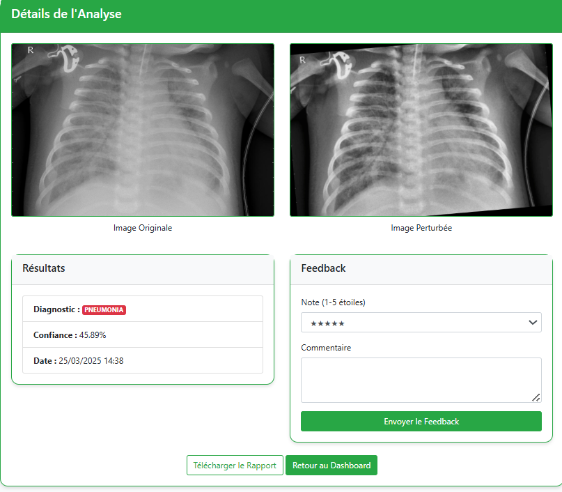
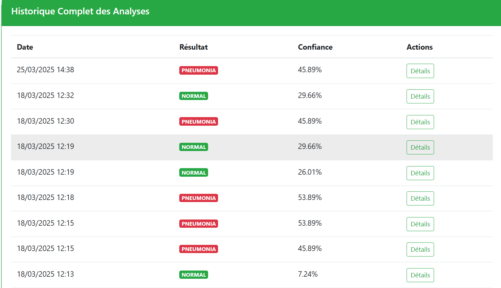
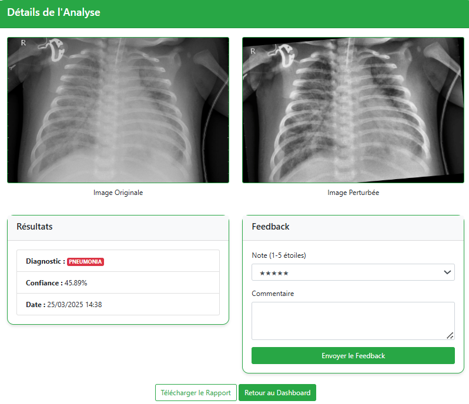

# Rapport Projet PneumoScan
**Détection de Pneumonie par Intelligence Artificielle**
>Auteur: Issakha Diouf

> 
>Ecole Superieure Polythechnique de Dakar
> 
> DIC3 - SSI

> Robustesse et sécurité de l'intelligence artificielle et du big data

**Le code source est disponible sur ce [github](https://github.com/Id8987/pneumonia-detect-deep-leaning)**

---

## Introduction
PneumoScan est une solution innovante conçue pour révolutionner le diagnostic précoce des pneumonies grâce à l’intelligence artificielle. En combinant des algorithmes de deep learning avec des techniques avancées de traitement d’images, ce système permet une analyse rapide et précise des radiographies thoraciques. Développé pour répondre aux besoins critiques des professionnels de santé, il réduit les erreurs d’interprétation tout en offrant une interface intuitive adaptée aux environnements cliniques.

---

## Fonctionnalités Principales
1. **Authentification Sécurisée**
    - Gestion des utilisateurs (médecins/radiologues)
2. **Analyse Automatisée**  
Le cœur du système repose sur un modèle CNN (VGG16/EfficientNet) entraîné sur un dataset de 5 863 radiographies avec deux categories *pneumonia / normal*. Le pipeline d’analyse inclut :
   - Prétraitement : Amélioration du contraste (CLAHE).

   - Inférence : Prédiction en moins de 2,5 secondes avec un taux de confiance affiché.

   - Visualisation 
3. **Prétraitement Avancé**
    - Débruitage non-local
    - Amélioration du contraste (CLAHE)
4. **Génération de Rapports**  
   Chaque diagnostic produit un rapport PDF détaillé comprenant des métriques techniques (précision, sensibilité, spécificité) et une comparaison visuelle entre l'image originale et l'image traitee.
5. **Historique Intelligent**
    - Suivi des diagnostics avec statistiques

---

## Technologies Clés
| Catégorie         | Outils                          |
|-------------------|---------------------------------|
| Backend           | Flask, SQLAlchemy               |
| Machine Learning  | TensorFlow, OpenCV              |
| Base de Données   | SQLite                         |
| Frontend          | Bootstrap, Jinja2              |
| Visualisation     | Matplotlib, ReportLab          |

---

## Capture d'Écrans

### Interface Utilisateur

*Landing Page*

*Formulaire d'authentification*

---

*Vue globale des fonctionnalités et historique*

---

### Processus d'Analyse

*Interface de sélection des radiographies*

---

*Comparaison visuelle et métriques de confiance*

---

*Possibilite de revoir les details d'une analyse*

---

### Historique d'analyse 

*Historique des analyses*

---

*Details de l'analyse*

## Documentation technique:

Se referer au fichier [README](https://github.com/Id8987/pneumonia-detect-deep-leaning)
